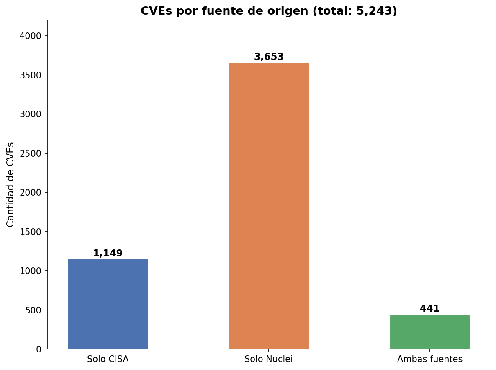
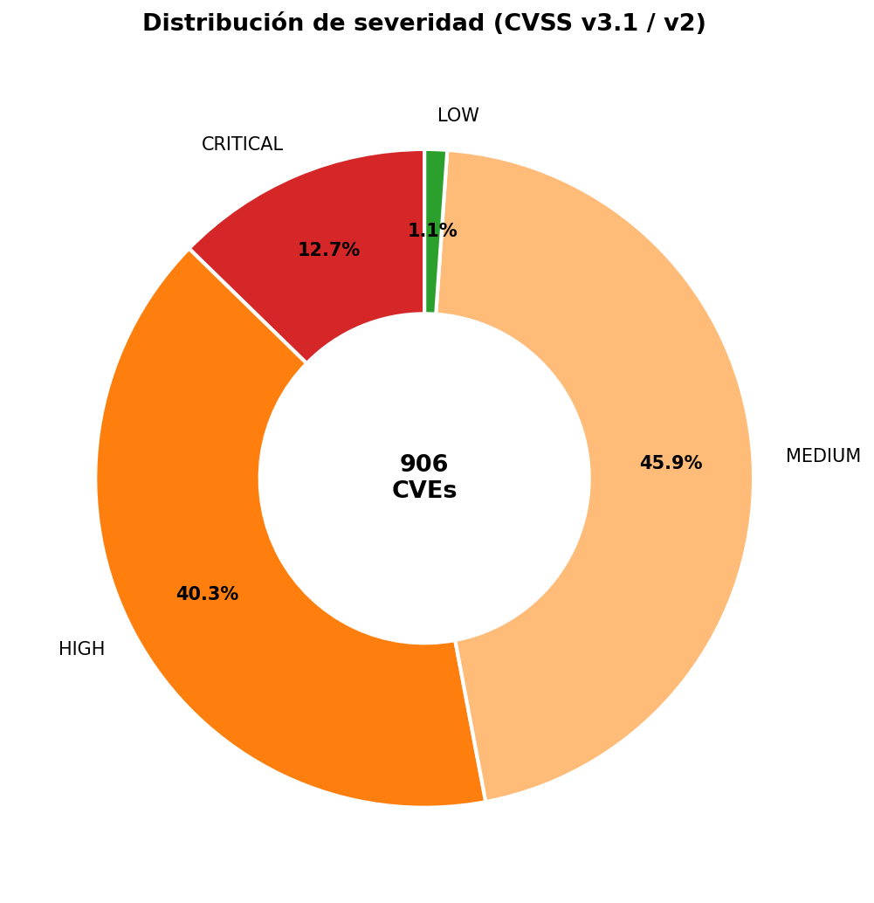
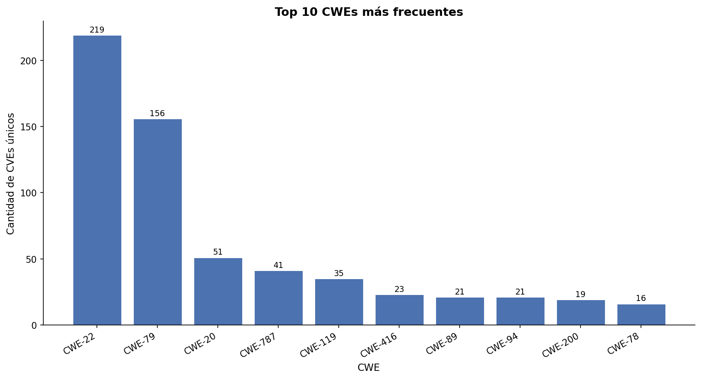
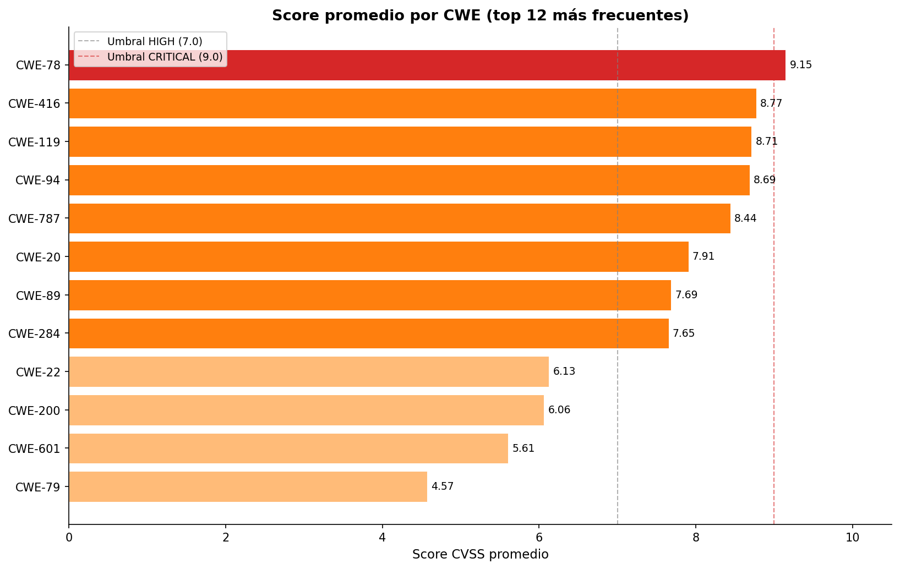
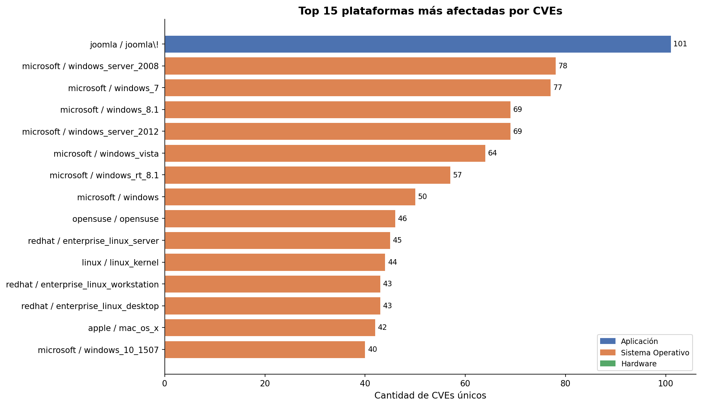
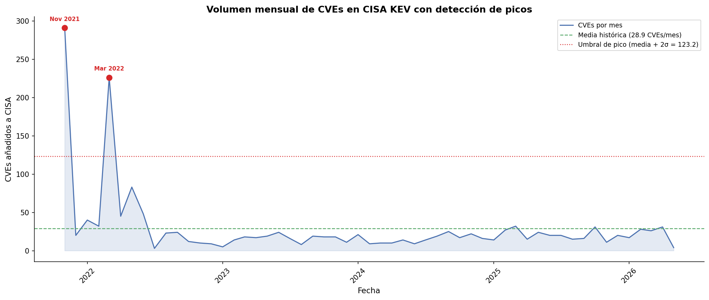
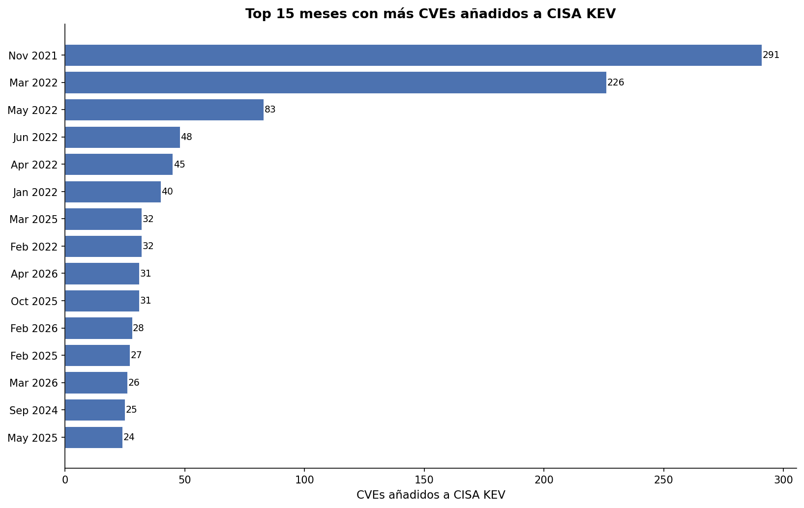

# Etapa 1 – Análisis de Vulnerabilidades CVE

**Autor:** Cesar Ospina Muñoz  
**Fecha:** 2026-05-12  
**Rol:** Analista de Metodologías de Riesgo Cibernético y Tecnológico

---

## ¿Qué hace este proyecto?

Este script consume dos fuentes públicas de vulnerabilidades conocidas, las enriquece con datos técnicos de la API del NIST, y produce un conjunto de análisis y visualizaciones que permiten entender el panorama de riesgo de forma estructurada.

---

## Fuentes de datos

| Fuente | Descripción | Formato |
|--------|-------------|---------|
| **CISA KEV** | Catálogo de vulnerabilidades explotadas activamente. Publicado por la Agencia de Ciberseguridad de EE.UU. | JSON |
| **Nuclei** | Lista de CVEs con templates de detección activa. Publicada por ProjectDiscovery en GitHub. | NDJSON |
| **NVD / NIST** | Base de datos nacional de vulnerabilidades. Provee métricas CVSS, CWEs y CPEs por cada CVE. | API REST |

---

## Estructura del proyecto

```
Etapa1/
├── main.py                        # Orquestador principal
├── requirements.txt               # Dependencias
├── .env                           # API key del NIST
├── .gitignore
├── sources/
│   ├── cisa_kev.py                # Descarga y parseo de CISA KEV
│   └── nuclei.py                  # Descarga y parseo de Nuclei
├── api/
│   └── nvd_api.py                 # Cliente NVD con caché y reintentos
├── analysis/
│   └── visualizaciones.py         # Generación de gráficas PNG
├── cache/                         # Respuestas del NIST almacenadas localmente
└── output/                        # CSVs y gráficas generados
```

---

## Cómo ejecutarlo

```bash
# 1. Crear y activar el entorno virtual
python3 -m venv venv
source venv/bin/activate

# 2. Instalar dependencias
pip install -r requirements.txt

# 3. Configurar la API key del NIST en el archivo .env
NVD_API_KEY=api_key

# 4. Correr el script
python main.py
```

Al ejecutarlo, el sistema pregunta:

```
  Opciones:
    1. Consultar API del NIST
    2. Usar solo CVEs ya descargados en caché
```

- **Opción 1** — consulta el NIST por cada CVE. Con API key.
- **Opción 2** — usa los datos ya descargados en `cache/`. Inmediato, sin llamadas a la API.

---

## Campos extraídos por CVE desde el NIST

| Campo | Descripción |
|-------|-------------|
| `descripcion` | Descripción oficial en inglés |
| `cvss_v31_base_score` | Puntuación base CVSS v3.1 (0–10) |
| `cvss_v31_base_severity` | Severidad v3.1: LOW / MEDIUM / HIGH / CRITICAL |
| `cvss_v31_vector_string` | Vector de ataque v3.1 |
| `cvss_v31_exploitability_score` | Facilidad de explotación v3.1 |
| `cvss_v31_impact_score` | Impacto potencial v3.1 |
| `cvss_v2_base_score` | Puntuación base CVSS v2 |
| `cvss_v2_base_severity` | Severidad v2 |
| `cvss_v2_vector_string` | Vector de ataque v2 |
| `cvss_v2_exploitability_score` | Facilidad de explotación v2 |
| `cvss_v2_impact_score` | Impacto potencial v2 |
| `cwes` | Lista de debilidades asociadas (CWE) |
| `cpes` | Lista de plataformas y software afectados (CPE) |

---

## Archivos generados en `output/`

| Archivo                              | Contenido                                                     |
| ------------------------------------ | ------------------------------------------------------------- |
| `vulnerabilidades.csv`               | Dataset principal, un CVE por fila con todos los campos       |
| `cve_cwe_relacion.csv`               | Relación detallada CVE -> CWE                                 |
| `cwe_estadisticas.csv`               | Estadísticas agregadas por CWE (score promedio, máximo, etc.) |
| `cpe_ranking.csv`                    | Ranking de plataformas por cantidad de CVEs que las afectan   |
| `grafica_cves_por_fuente.png`        | Distribución de CVEs por fuente de origen                     |
| `grafica_top_cwes_frecuentes.png`    | Top 10 debilidades más comunes                                |
| `grafica_distribucion_severidad.png` | Distribución de severidad CVSS                                |
| `grafica_score_promedio_cwe.png`     | Score promedio por tipo de debilidad                          |
| `grafica_top_plataformas_cpe.png`    | Top 15 plataformas más afectadas                              |

---

## Resultados del análisis

### Resumen general

| Métrica | Valor |
|---------|-------|
| Total CVEs analizados | 5.243 |
| CVEs solo en CISA KEV | 1.149 |
| CVEs solo en Nuclei | 3.653 |
| CVEs presentes en ambas fuentes | 441 |

---

### CVEs por fuente de origen



Nuclei concentra la mayor parte del universo analizado con 3.653 CVEs exclusivos. Los 441 CVEs presentes en ambas fuentes representan el subconjunto de mayor prioridad: son vulnerabilidades que no solo tienen template de detección activa (Nuclei) sino que además han sido explotadas en el mundo real (CISA KEV).

---

### Distribución de severidad



De los 664 CVEs con datos de severidad disponibles, MEDIUM domina con el 46.8%, seguido de HIGH con el 40.4%. Los CVEs CRITICAL representan el 12.0%, aunque son minoría, son los de mayor urgencia de remediación inmediata. Solo el 0.8% cae en LOW, lo que nos indica que el dataset tiene alto contenido de vulnerabilidades críticas.

> La gráfica excluye los CVEs sin datos de severidad en el NIST para no distorsionar la distribución real.

---

### CWEs más frecuentes



| CWE | Nombre | CVEs |
|-----|--------|------|
| CWE-22 | Path Traversal | 200 |
| CWE-79 | Cross-site Scripting (XSS) | 94 |
| CWE-787 | Out-of-bounds Write | 34 |
| CWE-20 | Improper Input Validation | 26 |
| CWE-416 | Use After Free | 21 |
| CWE-94 | Code Injection | 17 |
| CWE-119 | Buffer Overflow | 15 |
| CWE-284 | Improper Access Control | 13 |
| CWE-89 | SQL Injection | 13 |
| CWE-77 | Command Injection | 12 |

**CWE-22 (Path Traversal)** lidera con 200 CVEs, vulnerabilidades que permiten a un atacante acceder a archivos fuera del directorio permitido. **CWE-79 (XSS)** ocupa el segundo lugar con 94 CVEs, siendo la debilidad más explotada en aplicaciones web.

---

### Score promedio por CWE



**CWE-77 (Command Injection)** tiene el score promedio más alto con 9.36, territorio CRITICAL. Esto indica que aunque no es el CWE más frecuente, cuando aparece tiende a ser extremadamente grave. **CWE-79 (XSS)** tiene el score más bajo (4.69, MEDIUM), lo que refleja que su impacto depende mucho del contexto de la aplicación.

---

### Plataformas más afectadas



| Posición | Vendor / Producto               | CVEs | Tipo       |
| -------- | ------------------------------- | ---- | ---------- |
| 1        | Joomla / Joomla                 | 100  | Aplicación |
| 2        | Microsoft / Windows Server 2008 | 57   | SO         |
| 3        | Microsoft / Windows 7           | 56   | SO         |
| 4        | Microsoft / Windows Vista       | 52   | SO         |
| 5        | Microsoft / Windows 8.1         | 48   | SO         |
| 6        | Microsoft / Windows Server 2012 | 48   | SO         |
| 7        | OpenSUSE / OpenSUSE             | 46   | SO         |
| 8        | Microsoft / Windows             | 44   | SO         |
| 9        | Apple / Mac OS X                | 41   | SO         |
| 10       | Linux / Linux Kernel            | 38   | SO         |

**Joomla** es el software de aplicación más vulnerable del dataset con 100 CVEs únicos. Microsoft domina el ranking de sistemas operativos con múltiples versiones de Windows, en su mayoría versiones ya sin soporte, lo que explica el alto número de vulnerabilidades acumuladas sin parche.

---

## Mecanismos de robustez implementados

**Caché local** 
cada respuesta del NIST se guarda como archivo JSON en `cache/`. Si el script se interrumpe, los CVEs ya consultados no se vuelven a descargar en la siguiente ejecución.

**Reintentos automáticos** 
Si la API del NIST falla por error de red o servidor, el script reintenta hasta 3 veces con 5 segundos de espera entre cada intento.

**Rate limiting** 
El script respeta los límites de la API del NIST automáticamente: 1.5 segundos entre peticiones con API key (50 req/min) y 10.5 segundos sin key (6 req/min).

**Modo bypass** 
Al ejecutar el script se puede elegir trabajar solo con el caché existente para generar los análisis y gráficas de forma inmediata sin consultar la API.

---

## Dependencias

```
requests==2.32.3
pandas==2.2.3
tenacity==9.0.0
python-dotenv==1.0.1
tqdm==4.67.1
matplotlib==3.10.1
```

---

## Análisis de tendencias temporales

### Volumen mensual con detección de picos



La línea temporal muestra el volumen de CVEs añadidos a CISA KEV por mes desde el inicio del catálogo. Se detectaron 2 picos estadísticamente significativos, meses que superaron la media histórica de 28.9 CVEs/mes en más de 2 desviaciones estándar (umbral: 123.2 CVEs/mes).


---

### Meses con más CVEs en CISA KEV



| Mes          | CVEs añadidos | Contexto                                                                                                               |
| ------------ | ------------- | ---------------------------------------------------------------------------------------------------------------------- |
| **Nov 2021** | 291           | Lanzamiento oficial de CISA KEV, carga masiva del backlog histórico acumulado                                          |
| **Mar 2022** | 226           | Contexto geopolítico: inicio del conflicto Rusia-Ucrania, CISA acelera incorporaciones ante amenazas de estados-nación |
| **May 2022** | 83            | Continuación del período de alta actividad post-conflicto                                                              |
| **Jun 2022** | 48            | Normalización progresiva del ritmo de incorporación                                                                    |
| **Abr 2022** | 45            | Período de alta actividad                                                                                              |

A partir de mediados de 2022 el volumen se estabiliza alrededor de la media histórica de **28.9 CVEs/mes**, lo que indica que el proceso de CISA maduró hacia un modelo reactivo y continuo.

---

### Archivos adicionales generados

| Archivo | Contenido |
|---------|-----------|
| `tendencia_volumen_mensual.png` | Línea temporal con picos marcados |
| `tendencia_top_meses_cisa.png` | Top 15 meses por volumen de CVEs |
| `tendencia_tiempo_nvd_a_cisa.png` | Distribución de días NVD → CISA |
| `tendencia_picos_significativos.csv` | Meses identificados como picos estadísticos |
| `tendencia_tiempo_nvd_a_cisa.csv` | Detalle de tiempo por CVE |